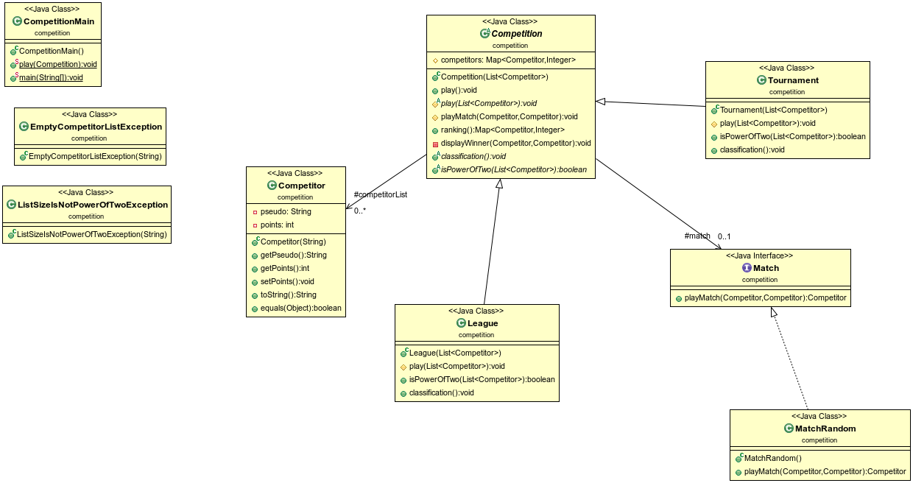

------------------------------------------------------------------------
                                Projet 1 COO
------------------------------------------------------------------------
## PROJECT TITLE:

  compétition

## PURPOSE OF PROJECT:

  Le projet a pour objectif de simuler des matchs avec un choix de compétition

## VERSION or DATE:

  10/10/2021

## AUTHORS:

  Adama TRAORÉ

## USER INSTRUCTIONS:

  Récuperation du projet avec la commande :

  * `>>> git clone git@gitlab-etu.fil.univ-lille1.fr:traorea/adama-traore-coo-l3g4-project.git `

  ## Compiler tout le dossier (classes) :

  on se place dans 
  * `>>>cd adama-traore-coo-l3g4-project`
  puis pour compiler, faites la commande 

 *  `>>> javac -encoding utf8 -d cls -cp cls src/competition/*.java src/util/*.java`

  ## Générer la documentation :
  
   on se place dans 
  * `>>>cd adama-traore-coo-l3g4-project`

  puis pour compiler, faites la commande 
  
  * `>>> javadoc -d  doc  -cp doc src/competition/*.java src/util/*.java`

  ## creation du jar

  on se place dans 
  * `>>>cd cls`

  puis faites la commande
  * `jar cvmf ../manifest-ex ../competition.jar competition/*.class util/*.class`

  ## Consulter documentation :

Ouvrir le fichier index.html puis pacourir tous les fichiers.

## Compilatition des tests

pour la compilation des classes de tests il fallait installer la version recente de jdk.
j'ai essayé de l'installer sur ma machine personnelle ainsi que sur les ordinateurs du M5 mais à chaque fois j'ai des erreurs mais parcontre sur eclipse les tests passent sans erreur.

## Lancer le jeu

Placez vous dans le dossier
* `>>>cd adama-traore-coo-l3g4-project`

puis pour lancer, faites la commande :

pour la league : `java -jar competition.jar  L Lynx Raven Drift Catalyst Midas Blastoff `  

                    ou 

pour le tournament: `java -jar competition.jar  T Lynx Raven Drift Catalyst Midas Blastoff  Etoile Olympique`

## Element de code:
  Mise en pratique des principes SOLID, notamment l'open closed principle sur les types de compétitions et les types de match. Mise en pratique du TDD (Test Drive Development).

## Remarque :
  Pour l'exécution du projet, j'ai choisi de permettre à l'utilisateur d'entrer sur la ligne de commande le type de compétition (L ou T) ainsi que les noms des Competitors, ce qui m'a valu de faire un switch dans la fonction main, ce qui en effet ne respecte pas l'OCP.
## Diagramme UML :

