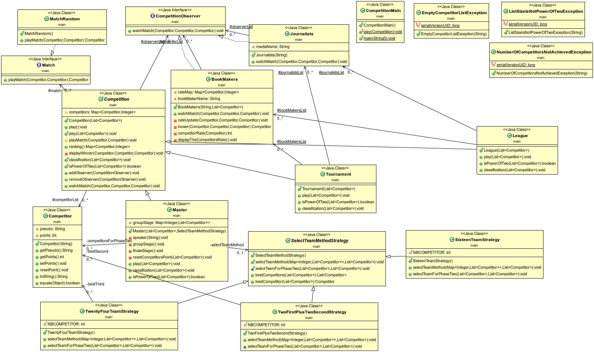

------------------------------------------------------------------------
                                Projet 3 COO
------------------------------------------------------------------------
## PROJECT TITLE:
  compétition

## PURPOSE OF PROJECT:

  Le projet a pour objectif de simuler des matchs avec un choix de compétition
## VERSION or DATE:

  12/12/2021
  

## AUTHORS:

  Adama TRAORÉ & Esam Sharfeldin

## USER INSTRUCTIONS:

  Récuperation du projet avec la commande :

  * `>>> git clone git@gitlab-etu.fil.univ-lille1.fr:traorea/adama-traore-coo-l3g4-project.git `

  ## Compiler tout le dossier (classes) :

  on se place dans 
  * `>>>cd adama-traore-coo-l3g4-project/version_3`
  puis pour compiler, faites la commande 

 *  `>>> make cls `

  ## Générer la documentation :
   pour générer, faites la commande 
  
  * `>>> make doc`

  ## compiler les tests :
  puis pour compiler, faites la commande 
 * `>>> make test`

  ## creation du jar

  faites la commande
  
  * `make jar`

  ## Consulter documentation :

Ouvrir le fichier index.html puis pacourir tous les fichiers.

## Lancer le jeu

 pour lancer, faites la commande :

 `>>> make T`   pour le tournament.                                                          
 `>>> make L`   pour la league.                                                                     
 `>>> make M16`   pour une competition avec 16 équipes.                                             
 `>>> make M24`    pour une competition avec 24 équipes.                                             
 `>>> make M32` pour une competition avec 32 équipes.                                                

 pour supprimer le dossier cls et doc faites la commande:                                            
 `>>> make clean`

## Element de code:
  Mise en pratique des principes SOLID, notamment l'open closed principle sur les types de compétitions et les types de match. Mise en pratique du TDD (Test Drive Development).  Mise en pratique pour la 3ème version du projet, le design pattern strategy

## Difficultés rencontrées :
 Nous avons réussi le test de addObserver
 parcontre pour rateUpdateTest,competitorRateTest, looserTest nous avons eu des difficultés car il fallait faire le test de l'interface CompetitionObserver, faire le test d'une interface nous a semblé bizare.
## Diagramme UML :

